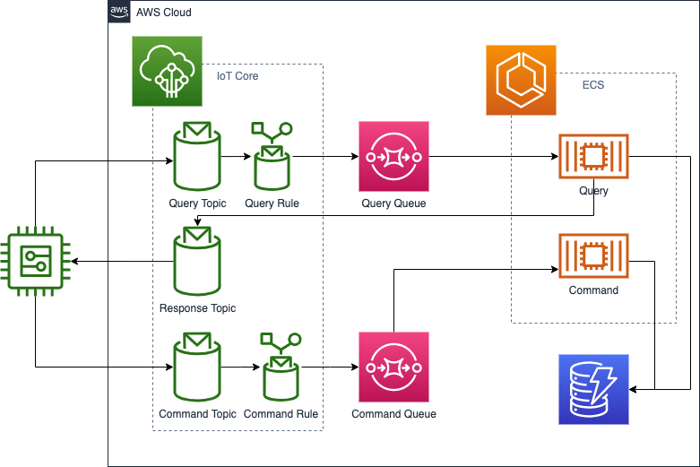

# Implementing CQRS using AWS IoT and Amazon Elastic Container Service
## Introduction
This sample app will illustrate how to setup an IoT client device to use a CQRS (Command Query Responsibility Segregation, see more on [https://www.martinfowler.com/bliki/CQRS.html](https://www.martinfowler.com/bliki/CQRS.html) architecture pattern. 
The goal is to demonstrate the CQRS concept can be used to separate request/reply and publish/wake up messages from update and status messages which can be useful in a constraint battery powered device for use cases like Firmware updates, positioning monitoring, and weather climate measuring. AWS Service included are:
* IoT Core
* DynamoDB
* Simple Queue Service (SQS)
* Elastic Container Service (ECS)
* Elastic Container Registry (ECR)
* IAM 
* CDK (Cloud Development Kit)



## Deplyoment

After you have cloned the repository in a terminal windown run: `make init`.
Deployment is performed by issuing: `make deploy`.

## IoT Sample Client Setup

Lets start by activating the virtual environment that was created during the Deployment phase. This is done by running the following command in your terminal 
```
cd iot_client
source venv/bin/activate
```

Some of common patterns for registering IoT devices with AWS IoT core are [Just-In-Time Provisioning (JITP)](https://aws.amazon.com/blogs/iot/setting-up-just-in-time-provisioning-with-aws-iot-core/) or [Just-In-Time Registration (JITR)](https://aws.amazon.com/blogs/iot/just-in-time-registration-of-device-certificates-on-aws-iot/). Going through those patterns are not part of this sample demo so to create a "Thing", create and download certificate + private key, and to attach the policy for your sample client you can run this command:
```
python3 create_thing_and_cert.py --thingname <Optional, give a thing name, if not supplied it defaults to CQRS-Sample-Thing>
```
You can accomplish the same task as the script by going into the AWS console, go to IoT Core > Manage > Things. Then choose to create a Thing followed by choosing Security > Create Certificate then to Attach a Policy. The policy created by the CDK stack that you should select is called "sample-cqrs-iot-policy"
Do the following steps to configure the IoT test client:

Start the Sample Client by running this command in the terminal:
```
python3 sample_client.py --deviceid <set a deviceid, default is SampleClient1>
```

## Clean-up

In order to tear down all the AWS resources created in the CDK stack you must first de-attach and remove the certificate created in the setup step. This is done using the following command (make sure you are in the iot-client directory):
```
python3 delete_thing_and_cert.py
```
You can accomplish the same task as the script by going in to the AWS console, go to IoT Core > Secure > Certificates. Then delete the certificate generated during setup

Remove the AWS resources by issuing the follwing command from the top folder in a terminal window from project root: `make destroy`

## Security

See [CONTRIBUTING](CONTRIBUTING.md#security-issue-notifications) for more information.

## License

This library is licensed under the MIT-0 License. See the LICENSE file.
